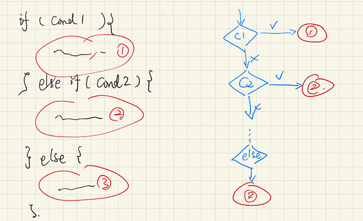
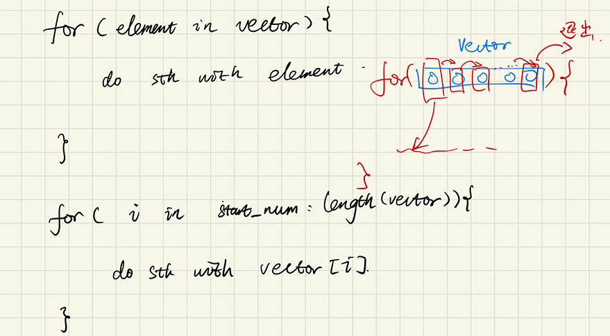
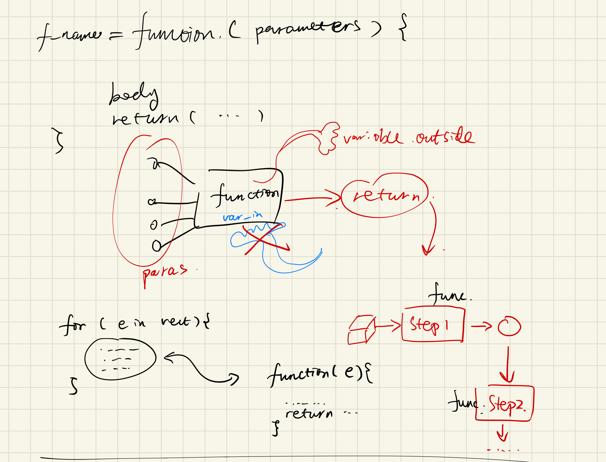

> 说明：
> 教程都是用rmd文件写的，大体上就是支持r语言的markdown。请在rstudio中打开rmd文件。请从上往下阅读教程，并**逐个**运行代码块（就是由```{r}和```括起来的文本部分）。代码块右上方有一个绿色的三角，点击就可以运行。

# R语言基础

## 补充材料：关于factor

factor是R处理分类变量的一种工具。与factor相关联的是另外一个工具levels。这两个东西在下面我们一起讲

比如看看下面的[代码（参考dataframe）]（https://campus.datacamp.com/courses/free-introduction-to-r/chapter-4-factors-4?ex=4）：

```{r}
survey_vector <- c("1", "2", "2", "1", "1")
factor_survey_vector <- factor(survey_vector)
print(factor_survey_vector)
```

`factor(vec)`会将vec进行整理，然后提取里面的唯一值，存储到levels里面。可以看到上面的程序运行返回结果中，关于levels的说明:`Levels: 1 2`。一般而言这个levels的排序是按照字符表顺序去排列的。接下来我们根据这个1和2代表的意义定义levels（在上面的数据中1表示男性，2表示女性）

```{r}
factor_survey_vector = factor(survey_vector,levels=c('1','2'),labels=c('男','女'))
factor_survey_vector
```

这个操作类似于spss中设置label value的动作，但是要方便的多，这也就是写代码的好处。

summary是一个获取统计量的函数，我们比较一下生成factor以前和转换成factor以后的summay，感受一下为什么应该转换成summary

```{r}
summary(survey_vector)
summary(factor_survey_vector)
```

可以明显的看到，对字符串向量作summary是没法获得什么有意义的信息的，但是转换成factor以后就不同了。

性别是我们分类变量中典型的无序变量。在上面的编码中，虽然我们用1表示男性，2表示女性，但是如果我们对`factor_survey_vector[1]`（女性）和`factor_survey_vector[2]`（男性）进行比较的话：

```{r}
factor_survey_vector[1]>factor_survey_vector[2]
```
会看到`not meaningful for factors`的报错，毕竟**无序变量是不能比较大小的**。

### 有序变量

分类变量还有一类是有序变量，比如优，良，中，差


```{r}
eff_vect = c("治愈","好转","加重","无效","好转")
eff_factor = factor(eff_vect)
print(eff_factor)
```

之前提到，R在建立factor的时候是按照字符表顺序建立的，具体到中文大概就是按照拼音顺序排列，所以我们看到上面的levels没办法表达实际的顺序，为了解决这个问题我们要重新修改一下代码:

```{r}
eff_vect = c("治愈","好转","加重","无效","好转")
eff_factor = factor(eff_vect,ordered = TRUE, levels = c("加重","无效","好转","治愈"))
print(eff_factor)
```

现在我们可以比较一下`eff_factor[1]`和`[2]`了

```{r}
eff_factor[1]>eff_factor[2]
```

## 学习材料：matrix操作

下面的程序是示范将两个向量形成一个matrix并进行行列求和，matrix合并等操作

```{r}
# 将两个向量合并形成一个向量
zhang = c(70,75,82,71,60)
li = c(58,70,80,66,55)
print(c(zhang,li))
```

使用matrix函数逐列填充矩阵
```{r}
m_score = matrix(
  c(zhang,li),ncol = 2,byrow = FALSE
)
print(m_score)
```

接下来还可以给matrix命名`rownames`和`colnames`

```{r}
# matrix命名
curri_name = c('biology','stat','medicine','surgery','math')
rownames(m_score)= curri_name
colnames(m_score)= c('zhang','li')
```

行求和:
```{r}
rsum = rowSums(m_score)
print(rsum)
```
列求和：
```{r}
csum = colSums(m_score)
print(csum)
```

用rbind和cbind添加行和列

```{r}
m_score_cbinded = cbind(m_score,rsum)
print(m_score_rbinded)
```

```{r}
m_score_rbinded = rbind(m_score,csum)
print(m_score_rbinded)
```

**rbind和cbind不仅仅在matrix可以用，在dataframe里面也可以用**

## 学习材料：dataframe操作

课上我们用来举例的那个收支表格，让我们先写进r的程序：

```{r}
riqi = c(
  as.Date("2019-10-20"),
  as.Date("2019-10-21"),
  as.Date("2019-10-22"),
  as.Date("2019-10-23"),
  as.Date("2019-10-24"),
  as.Date("2019-10-25"),
  as.Date("2019-10-26")
)
jin_e = c(100,-80,-20,-12,10,-23,50)
xiangmu = c("收入","手机充值","吃饭","吃饭","中奖","吃饭","收入")
wday = c("sun","mon","tue","wed","thu","fri","sat")
col_name = c("日期","金额","项目")
```

> r有多种工具来实现数据的导入和导出，包括read.table, read.csv等

上面的代码里我们建立了三列数据的向量`riqi`, `jin_e`, `xiangmu`，还有行名称向量`wday`，列名称向量`col_name`。现在用这些向量来建立一个dataframe

```{r}
df = data.frame(riqi,jin_e,xiangmu)
rownames(df) = wday
colnames(df) = col_name
```

上面代码的第一行是建立一个dataframe，然后对各行和各列命名。

> r自带了很多dataset，可以用`data()`命令查看
> 在Rstudio里，用`View(df)`可以查看df这个数据框

### 选择，筛选，排序

关于选择和筛选先讲一些重要的：

1. 涉及选择，使用`[]`
2. 选择的方式有很多：
  1. 数值序号。R的排序从1开始，所以选择第一个元素就是1，第二个元素就是2
  2. 名称。当你做了命名以后，(`rownames`,`colnames`,`names`)接下来就可以用名称选择对应的元素
  3. 组合：如果要选择多个元素，使用`c(...)`建立向量，比如选择1，3，4元素：`c(1,3,4)`。`c()`可以用于名称组合和序号组合
  4. 序号组合的快捷写法：当我们要选择一个范围的内容的时候（比如从1到4）除了使用`c(1,2,3,4)`以外，还可以写成`1:4`
3. 对于向量，它是1维的，所以`v[1]`,`v[c(1,2)]`就可以
4. 对于matrix like(矩阵，数据框...)，这些有2维，还是使用`[]`写选择，但是要说明行和列：`[行,列]`
5. 筛选不是靠提供序号或者名称，而是靠提供一个**筛选向量**

下面的代码将选择一个向量的第二个元素
```{r}
vect_a = c('a','b','c')
vect_name = c('1st','2nd','3rd')
names(vect_a) = vect_name
print(vect_a[2])
print(vect_a['2nd'])
```

下面的代码将对df这个数据框做选择
```{r}
# 行，
df[1,]
# ，列
df[,1]
#行，列
df[1,1]
```

接下来看一下如何筛选。比如我们想找到df的支出中，项目为"吃饭"的行

```{r}
vect_sel = df['项目']=='吃饭'
df[vect_sel,]
```
请注意`vect_sel`后面的逗号

## list

关于list，最重要的就是`[[]]`表示list下面的元素选取。就是这样

---

# 常规语句

## 关系表达式

```{r}
3 == (2 + 1)
"intermediate" != "r"
TRUE != FALSE
"Rchitect" != "rchitect"
```

不管是流程控制还是循环，判定表达式都是基础。判定表达式只会返回TRUE或者FALSE

上面的代码展示了`==`（相等）和`!=`（不相等）两个判断符号

```{r}
(1 + 2) > 4
"dog" < "Cats"
TRUE <= FALSE
```

上面的代码展示了不等式比较，试一下修改不等号的方向看一下结果有什么变化

## 逻辑关系符号 `& | !`

用和`&`或`|`否`!`这三个符号可以进一步把关系表达式组合起来

```{r}
TRUE & TRUE
FALSE | TRUE
5 <= 5 & 2 < 3
3 < 4 | 7 < 6
!TRUE
```

比如说现在有一个向量`1:10`，我们要选取3到8之间的数据，那可以怎么写呢？

```{r}
v_a = 1:10
sel = v_a <= 8 & v_a >=3
v_a[sel]
```
 试着参照上面的程序补全下面的代码(用___标明），提取df里面支出在40到10之间的记录
```{r}
sel = df[,'金额']__ -40 __ df[,'金额']__ -10 
df[sel,]
```

## if，while，for, function, apply

### if

if语句的结构如下图所示



现在我们考虑这样一个问题，当我们需要从一个dataframe根据行和列获取数据的时候，应该遵循怎样的一个逻辑呢？

1. 行和列是数值变量
2. 行和列不应该小于0，行不应该超过dataframe的行数，列不应该超过dataframe的列数
3. 行和列至少要提供一个参数才能返回需要的数据（行和列不应该同时为0）
4. 行为0的时候返回全列，同样的，列为0的时候返回全行
5. 如果行和列都非0，返回对应的单元格

```{r}
m = 10
n = 3
df = mtcars

if (!is.numeric(m) | (!is.numeric(n))){
  #m或n不为数值的时候报错
  print("m和n应该是数值")
}else if(m<0 | m>dim(df)[1] | n<0 | n>dim(df)[2]){
  #m或n不应该小于0或者大于df的行和列
  print("m或n超出正常范围")
}else if(m==0 & n==0){
  #m和n不应该同时为0
  print("m或n不应该同时为0")
}else if(m==0){
  #m为0时输出全列
  print(df[,n])
}else if(n==0){
  #n为0的时候输出全行
  print(df[m,])
}else{
  print(df[m,n])
}
```
### for循环

for循环的工作流程如下图



两种for循环方式（直接遍历集合的元素/遍历一个范围内的序号，通过序号获取元素）都是常见的做法，不过要想遍历一个dataframe的各行，第二种方式可能更常见：


```{r}
for (i in 1:dim(mtcars)[1]){
  print(mtcars[i,])
}
```

对于下面一个问题：

> mtcars中，新生成一列 cyl_grp ，cyl==4的时候cyl_grp=1，cyl==6的时候，cyl_grp=2，cyl==8的时候，cyl_grp=3

用for循环的话可以这么写：

```{r}
cyl_grp = c()
# 逐行遍历mtcars
for(i in 1:dim(mtcars)[1]){
  # i这时候代表的是第几行
  if(mtcars[i,'cyl']==4){
    # cyl_grp这个向量如果竖着看，第i行就是第i个元素了：
    cyl_grp[i]=1
  }else if(mtcars[i,'cyl']==6){
    cyl_grp[i]=2
  }else if(mtcars[i,'cyl']==8){
    cyl_grp[i]=3
  }else{
    # 4，6，8都不是的话就输出错误吧
    print("ERROR")
  }
}
# 利用cbind将新计算出来的cyl_grp向量并入dataframe
mtcars_mod = cbind(mtcars,cyl_grp)
```

### function

可以用类似下面的代码定义一个函数

```{r}
function_name = function(args...){
  ...
  return(xx)
}
```




关于函数

1. 函数就像上图中间的这个机器，获取一系列的参数（parameters)，然后通过一系列的运算返回一个东西（numeric值，TRUE/FALSE，字符串，向量，dataframe等等）
2. 函数的内部可以获取外部的信息，但是外部不能够获取内部的数据
3. 在实现任何功能的过程中，你的操作都会分成多步，每一步都应该可以转换成一个函数。


### 联用

比如说我现在想把mtcars里的记录分成4类：hp>146.7,mpg<20.09;hp<146.7,mpg<20.09;hp>146.7,mpg>20.09以及hp<146.7,mpg>20.09;这四类分别标为1,2,3和4。如何运用for循环和if来实现这个需求呢（for循环就是while循环的语法糖）

首先，怎么遍历一个dataframe的各行呢？
```{r}
for (i in 1:nrow(mtcars)){
  print(mtcars[i,])
}
```

那么，如何根据hp和mpg来计算分类呢？假如现在我们有hp=150，mpg=18
```{r}
hp = 150
mpg = 18
class_n = 0
if (hp >146.7 & mpg <20.09){
  class_n = 1
}else if(hp<146.7 & mpg < 20.09){
  class_n = 2
}else if(hp>146.7 & mpg >20.09){
  class_n = 3
}else{
  class_n = 4
}
print(class_n)
```
可以看到判断的结果没有问题，现在把上面的代码放到循环的里面，然后从mtcars里面使用行号（i）和列名字（'hp'和'mpg'）来读取对应的hp以及mpg，生成各行的class_n值。

这样一来我们会有很多的class_n值，应该怎么存储呢？用vector

```{r}
class_n_vect = c()
for (i in 1:nrow(mtcars)){
  hp = mtcars[i,'hp']
  mpg = mtcars[i,'mpg']
  if (hp >146.7 & mpg <20.09){
    class_n_vect[i] = 1
  }else if(hp<146.7 & mpg < 20.09){
    class_n_vect[i] = 2
  }else if(hp>146.7 & mpg >20.09){
    class_n_vect[i] = 3
  }else{
    class_n_vect[i] = 4
  }
}
print(class_n_vect)
```

现在我们还可以用cbind把刚刚算出来的这个class_n_vect加入mtcars数据框
```{r}
new_mtcars = cbind(mtcars,class_n_vect)
head(new_mtcars)
```

如果看不到刚刚生成的class_n_vect的话可以将滚动条往右边拉一下

但是说实话，没有人会这么写的，上面的操作其实不需要用for循环。

### apply系列函数

以sapply为例这里讲解apply系列函数的概念。

```
sapply(X, FUN, ..., simplify = TRUE, USE.NAMES = TRUE)
```

sapply的第一个参数是一个**向量**，第二个参数是一个函数的名称。sapply的意义在于，逐个获取X的各个元素，作为参数交给FUN指向的函数，函数随后利用return返回运算结果。比如下面这段代码，将会计算向量中各个字符串的长度

```{r}
vect_str = c('abc','e','evo','mjk12')
string_length = function(e){
  return(nchar(e))
}
vect_len = sapply(vect_str,string_length)
```
可以看到上面的代码实际上就等同于

```{r}
vect_str = c('abc','e','evo','mjk12')
vect_len = c()
string_length = function(e){
  return(nchar(e))
}
for (i in 1:length(vect_str)){
  vect_len[i] = string_length(vect_str[i])
}
```

每次你用for循环的时候，首先要想想，这个能不能用apply系列的语句写？是不是有内置的命令已经可以做到这个事情了？

回到前面的代码，我们可以用apply实现对类似矩阵对象的遍历。

apply的用法是`apply(X, MARGIN, FUN, ...)`，可以看到与sapply相比，apply多了一个参数MARGIN，MARGIN为1的时候是一行一行的喂给FUN，MARGIN为2的时候是一列一列喂给FUN

```{r}
class_n_func = function(car_record){
  hp = car_record['hp']
  mpg = car_record['mpg']
  if (hp >146.7 & mpg <20.09){
    class_n = 1
  }else if(hp<146.7 & mpg < 20.09){
    class_n = 2
  }else if(hp>146.7 & mpg >20.09){
    class_n = 3
  }else{
    class_n = 4
  }
  return(class_n)
}
# apply的第一个参数是应用对象，第二个参数是方向，1表示逐行遍历，2表示逐列遍历，第三格参数是函数名称
class_n_vect = apply(mtcars,1,class_n_func)
new_mtcars = cbind(mtcars,class_n_vect)
print(new_mtcars)
```